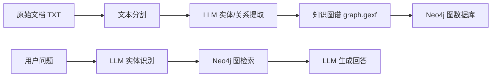
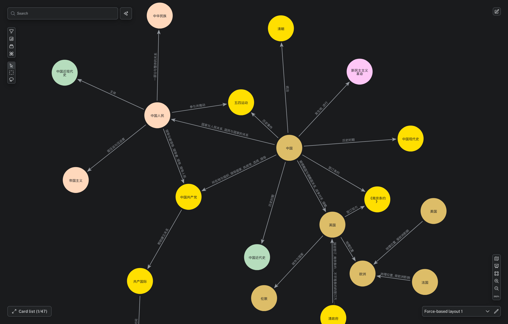
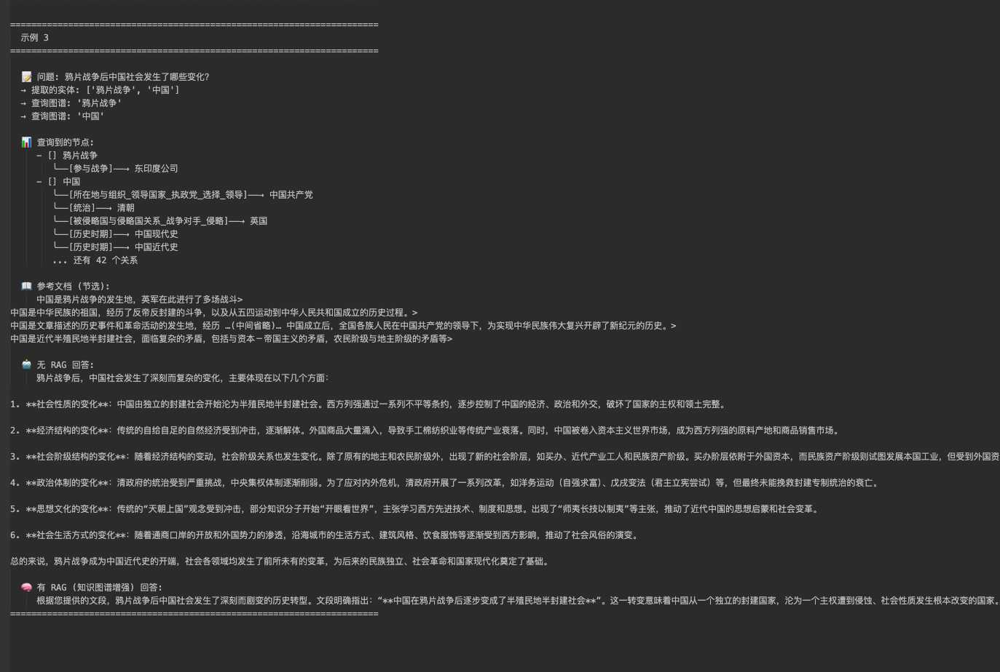

# GraphRag 知识图谱构建与问答系统

基于 **GraphRAG** 范式的知识图谱构建与检索增强生成（RAG）问答系统。支持从文档中自动提取实体和关系构建知识图谱，并通过图检索增强 LLM 回答。

## 核心流程



## GraphRag 文件夹内容

| 文件 | 功能 |
|------|------|
| **main.py** | 入口：读取 TXT → 文本分割 → LLM 提取实体与关系 → 构建 `graph.gexf` |
| **GraphRag.py** | RAG 问答：用户提问 → LLM 提取实体 → Neo4j 检索 → LLM 生成对比回答（无 RAG / 有 RAG） |
| **graph2neo4j.py** | 读取 `graph.gexf` 并上传到 Neo4j Aura 图数据库 |
| **graph.py** | 图数据结构和操作定义 |
| **llmRag.py** | LLM 驱动的实体提取与检索逻辑 |
| **dataclass.py** | 数据类定义 |
| **read_graph.py** | 图文件读取工具 |
| **neo4j2json关系.py / neo4j2json描述.py** | Neo4j 数据导出为 JSON |

### main.py — 知识图谱构建

读取 TXT 文档，通过 LLM 分阶段提取实体和关系，构建知识图谱并导出为 GEXF 格式。

- **文本分割**：基于 Token 的分割器，支持重叠分块
- **实体提取**：两阶段 Prompt 设计，先提取实体再提取关系
- **图构建**：使用 NetworkX 构建无向图，包含节点属性（名称、类型、描述）和边属性（关系描述、权重）

### GraphRag.py — RAG 问答

将用户问题经过实体识别 → 图检索 → LLM 生成的完整 RAG pipeline，并同时输出**无 RAG** 和 **有 RAG** 的回答以便对比。

- **实体识别**：LLM 从用户问题中提取关键实体
- **图检索**：在 Neo4j 中检索匹配节点及其邻接节点
- **对比回答**：同一问题分别用纯 LLM 知识和图谱增强知识回答

支持多个 LLM 后端（当前配置为 DeepSeek）。

### graph2neo4j.py — 图谱上传

将 `graph.gexf` 文件中的节点和关系上传至 Neo4j Aura 图数据库，支持增量上传和清除。

## 知识图谱展示



图为 Neo4j 中构建的近代史知识图谱，包含历史事件、人物、组织、地点等实体及其相互关系。节点大小和颜色代表不同类型，连线表示实体间的关系。

## RAG 问答效果对比



图为同一问题在 **无 RAG**（纯 LLM 知识）和 **有 RAG**（知识图谱增强）下的回答对比。有 RAG 的回答更贴近图谱中的结构化知识，能引用图谱中的具体关系（如《黄埔条约》），对图谱中缺失的信息也会主动说明。

## 关系提取 Prompt

采用两阶段提取策略，先识别实体，再从实体中提取关系：

| 设计点 | 说明 |
|--------|------|
| 两阶段提取 | 先提取实体，再从实体中提取关系，减少误判 |
| 结构化输出 | 使用分隔符 `\|` 便于程序解析 |
| 关系强度 | 权重字段，用于后续图分析 |
| Few-shot 示例 | 2 个示例提高准确性 |

## 快速开始

```bash
# 安装依赖
pip install openai neo4j networkx tiktoken tqdm

# 1. 构建知识图谱
cd GraphRag
python main.py

# 2. 上传到 Neo4j（需配置连接信息）
python graph2neo4j.py

# 3. 运行 RAG 问答
python GraphRag.py
```

## 配置说明

在 `GraphRag.py` 中配置 LLM 和 Neo4j：

```python
# DeepSeek 配置
client = OpenAI(api_key="your_key", base_url="https://api.deepseek.com")
model = "deepseek-v4-flash"

# Neo4j 配置
uri = "neo4j+s://your-instance.databases.neo4j.io"
user = "your_username"
password = "your_password"
```

支持切换其他兼容 OpenAI 接口的 LLM（如智谱 GLM、百度文心等）。
